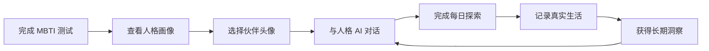
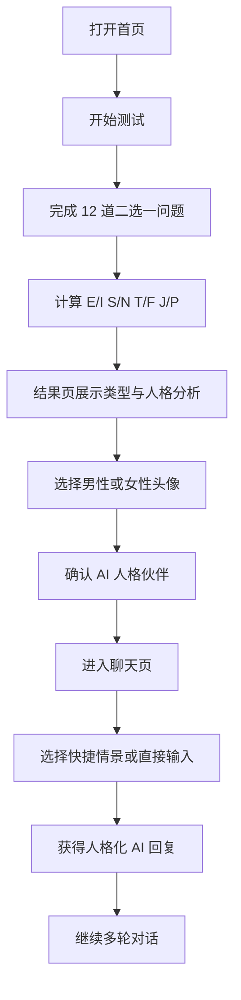

# MBTI AI 人格伙伴 PRD V2

## 1. 文档信息

| 项目 | 内容 |
| --- | --- |
| 产品名称 | MBTI AI 人格伙伴 |
| 当前版本 | V2 / P0 |
| 产品形态 | 面向年轻用户的 Web 人格探索与 AI 陪伴产品 |
| 核心验证 | 用户是否愿意在完成 MBTI 探索后，与人格伙伴持续对话 |
| 文档状态 | 已冻结 P0 范围，进入开发 |

## 2. 产品定位

### 2.1 一句话定位

完成一次轻量 MBTI 探索，获得一个理解你思考方式、陪你持续对话的 AI 人格伙伴。

### 2.2 核心价值

产品不是让用户拥有一个漂亮角色，而是让用户拥有一个帮助自己理解自己的 AI 人格伙伴。

### 2.3 用户闭环



P0 只交付 A 到 D 的完整闭环。每日探索、记录和长期洞察属于后续版本。

## 3. 方向调整

### 3.1 旧方向

MBTI 测试 → 角色换装 → 小屋养成。

### 3.2 新方向

MBTI 测试 → 人格画像 → 选择 AI 伙伴头像 → 人格 AI 聊天。

### 3.3 退出主流程

- AvatarEditor 与换装入口。
- 衣服、发型、配饰和 Avatar Layer 配置。
- 小屋、喂食、摸头和今日状态。
- 能量值、亲密值和成长等级。

相关代码和已有全身角色素材暂不删除，只从导航和用户主流程隐藏。后续可将全身立绘用于人格介绍、内容卡片和宣传素材。

## 4. 目标用户与核心任务

### 4.1 目标用户

- 16 至 30 岁，对 MBTI、自我理解、关系沟通和 AI 聊天感兴趣。
- 知道或不知道自己 MBTI 均可开始。
- 希望获得有共鸣、但不进行心理诊断的陪伴与反思空间。

### 4.2 核心任务

1. 两分钟内完成轻量测试。
2. 看懂自己的类型、关键词和偏好维度。
3. 选择男性或女性人格伙伴头像。
4. 立即开始连续对话。
5. 明显感受到不同 MBTI 在表达和思考路径上的差异。

## 5. 信息架构

| 页面 | 路径 | P0 状态 | 核心内容 |
| --- | --- | --- | --- |
| 探索首页 | `/` | 必须 | 产品定位、探索入口、开始测试 |
| MBTI 测试 | `/test` | 必须 | 问题、选项、进度、结果计算 |
| 人格结果 | `/result` | 必须 | 类型、分析、关键词、偏好维度、头像性别选择 |
| AI 聊天 | `/chat` | 必须 | 人格资料、头像、历史消息、快捷情景、连续对话 |
| 人格成长 | `/growth` | 占位 | P1 每日探索与趋势 |
| 人格记录 | `/journal` | 占位 | P1 日记与 AI 洞察 |
| 旧形象页 | `/create` | 隐藏 | 不进入导航，保留旧代码 |
| 旧小屋页 | `/room` | 隐藏 | 不进入导航，保留旧代码 |

## 6. P0 核心流程



用户已经有结果时，首页允许直接进入聊天；重新测试会覆盖类型结果，但保留用户主动选择的头像性别。

## 7. MBTI 测试

### 7.1 测试形式

- P0 使用 12 道二选一问题，每个维度 3 道。
- 每个选项只描述行为倾向，不直接暴露字母。
- 支持返回上一题、查看进度和重新开始。
- 提交后在浏览器本地完成计分，不需要登录。

### 7.2 计分

每个选项分别为 E/I、S/N、T/F、J/P 对应字母加 1 分。四组分别比较，得分相同时使用预设的中性追问题或稳定默认规则。

### 7.3 表达边界

- 结果使用“更倾向于”“当前测试显示”等表述。
- 不把 MBTI 当作能力、医学或心理诊断。
- 用户可以在结果页重新测试或手动校正类型。

## 8. 人格结果页

必须展示：

- MBTI 类型和中文人格名称。
- 3 至 4 个关键词。
- 核心动机、思考方式、关系偏好和压力反应。
- 四个偏好维度的相对得分。
- 男性、女性两个头像选项。
- “开始和伙伴聊天”主操作。

人格评分表示本次选择的偏好趋势，不使用“逻辑能力 85%”等能力诊断表达。

## 9. 人格头像系统

### 9.1 资产规格

- 16 MBTI × 2 性别，共 32 张头像。
- 肩部以上或胸部以上构图。
- 统一画幅、镜头距离、背景、光影、脸部比例和绘制精度。
- 重点依靠五官气质、眼神、表情、发型和氛围表达人格。
- 四色体系只作为辅助色彩语言，不使用纯色皮肤、几何头部或图标化身体。

### 9.2 使用位置

- 结果页头像选择。
- 聊天页人格资料区。
- AI 消息头像。
- 首页已拥有伙伴时的快捷入口。

### 9.3 数据结构

```ts
type AvatarProfile = {
  mbti: MbtiType;
  gender: "male" | "female";
  avatar: string;
};
```

旧版服装和配饰数据不再进入 V2 主状态，但保留兼容迁移，避免已有 localStorage 导致页面失败。

## 10. Persona Definition 系统

### 10.1 结构

```ts
type PersonaDefinition = {
  mbti: MbtiType;
  displayName: string;
  coreMotivations: string[];
  reasoningStyle: string[];
  speakingStyle: string[];
  emotionPattern: string[];
  favoriteTopics: string[];
  sensitiveTopics: string[];
  responseRules: string[];
};
```

### 10.2 原则

- 16 型使用同一个 Prompt 编译器，不维护 16 段彼此失控的巨大 Prompt。
- 人格只影响表达方式、关注点、提问方式和建议结构。
- 事实准确性、安全边界和不确定性表达对 16 型完全一致。
- 避免机械口癖、刻板印象和“所有某类型都……”的绝对判断。

## 11. AI 聊天

### 11.1 Prompt 结构

```text
统一身份与安全规则
+ Persona Definition
+ 用户 MBTI 测试结果
+ 当前快捷情景
+ 最近聊天记录
+ 用户最新消息
```

### 11.2 功能

- 接入服务端 LLM 接口，密钥只保存在服务端环境变量。
- 支持最近聊天历史和连续对话。
- 支持加载、错误和重试状态。
- 支持本地模板兜底，但必须明确处于离线模式。
- P0 保存最近 40 条消息到 localStorage。

### 11.3 快捷情景

已有的吵架、分手挽回和观点碰撞改为聊天快捷入口：

| 按钮 | 自动填入内容 |
| --- | --- |
| 我与朋友发生矛盾 | 我今天和朋友吵架了，我不知道该怎么继续沟通。 |
| 我在经历关系变化 | 一段重要关系发生了变化，我想整理自己的感受。 |
| 我想讨论一个观点 | 我有一个很在意的观点，想听你和我一起分析。 |
| 我需要开始行动 | 我知道该做什么，但现在很难开始，请陪我拆出第一步。 |

## 12. 本地数据

P0 使用 localStorage 保存：

- 测试答案和最近一次结果。
- MBTI 类型。
- 头像性别与头像路径。
- 最近 40 条聊天消息。
- 是否完成首次引导。

不保存服务端长期记忆，不上传日记，不建立用户账号。

## 13. 暂不开发

- 日记正文和 AI 日记洞察。
- 系统提醒和浏览器通知。
- 长期记忆。
- 关系值、亲密值和成长等级。
- 公开社区、社交分享和排行榜。
- 换装、装备、房间和虚拟养成。

`/growth` 与 `/journal` 只提供清晰的未来入口和 P1 说明，不存储用户内容。

## 14. P0 验收标准

- [ ] 用户能从首页进入测试。
- [ ] 用户能在两分钟内完成 12 道问题。
- [ ] 测试稳定生成一个 MBTI 类型和四维偏好。
- [ ] 结果页展示类型、关键词、分析和评分。
- [ ] 32 张男女头像均可正确加载。
- [ ] 用户可以选择头像性别并进入聊天。
- [ ] 切换头像后 localStorage 正确更新。
- [ ] 16 型 Persona Definition 均通过结构校验。
- [ ] 同一问题在代表性类型间体现明显思考与表达差异。
- [ ] AI 聊天使用真实服务端模型；无密钥时进入可识别的离线兜底。
- [ ] 最近 40 条消息刷新页面后仍存在。
- [ ] 主导航不出现换装、小屋或养成入口。
- [ ] 390px 和桌面宽度下无横向溢出。
- [ ] TypeScript、ESLint 和生产构建通过。

## 15. P1 与 P2

### P1：持续探索

- 每日人格探索题。
- 偏好趋势与测试历史。
- MBTI Journal。
- 基于多条记录的周期洞察。

### P2：长期陪伴

- 用户授权的长期记忆。
- 关系阶段与角色成长。
- 跨设备账号与隐私控制。

## 16. V2 成功标准

用户打开网站，在两分钟内完成探索、看到人格画像、选择自己的 AI 伙伴头像并开始聊天。首次对话后，用户能够明确感受到：这个 AI 的思考和表达方式与所选人格相符，同时仍然可靠、克制、不进行绝对化心理判断。
